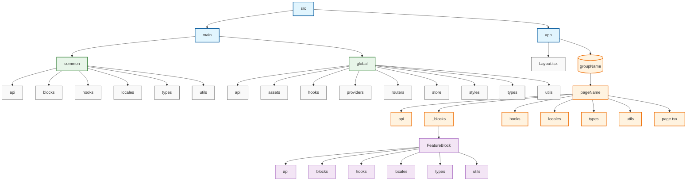

# Next.js Project Structure Documentation

## Overview
This document outlines the standardized project structure for our Next.js application. The structure is designed to be scalable, maintainable, and follows separation of concerns principles.

## Root Structure
```
📦src
 ┣ 📂main
   ┣ 📂common
   ┣ 📂global
 ┣ 📂app
```

## Directory Details

### 1. Common Directory (`/main/common/`)
Contains shared components and utilities that are used across multiple pages or blocks. Has a standardized structure:

- `api/`: API interfaces and services for common features
- `blocks/`: Reusable component blocks
- `hooks/`: Shared custom React hooks
- `locales/`: Internationalization files
- `types/`: TypeScript type definitions
- `utils/`: Helper functions and utilities

### 2. Global Directory (`/main/global/`)
Houses application-wide configurations and utilities:

- `api/`: Global API configurations and interceptors
- `assets/`: Static files (images, fonts, etc.)
- `hooks/`: Application-wide custom hooks
- `providers/`: React context providers
- `routers/`: Routing configurations
- `store/`: State management setup (Redux/Context)
- `styles/`: Global styles and themes
- `types/`: Global TypeScript definitions
- `utils/`: Global utility functions

### 3. UI Directory (`/app/`)
Contains the main application interface components:

#### AppLayout (`/app/Layout.tsx/`)
- Main layout components and templates
- Navigation components
- Common UI elements

#### Pages (`/app/`)
Organized by feature groups:
```
  📂(groupName)
    ┗ 📂pageName
        ┣ 📂api
        ┣ 📂_blocks
        ┣ 📂hooks
        ┣ 📂locales
        ┣ 📂types
        ┗ 📂utils
        ┗ page.tsx
```

## Component Structure Guidelines

### Page Components
Each page follows a standard structure:
- `api/`: Page-specific API calls
- `_blocks/`: Page-specific components
  - Each block can contain:
    - `api/`: Block-specific API calls
    - `blocks/`: Nested components
    - `hooks/`: Block-specific hooks
    - `locales/`: Block-specific translations
    - `types/`: Block-specific types
    - `utils/`: Block-specific utilities
- `hooks/`: Page-specific custom hooks
- `locales/`: Page-specific translations
- `types/`: Page-specific TypeScript definitions
- `utils/`: Page-specific utility functions

## Best Practices

### 1. Component Organization
- Keep components close to where they're used
- If a component is used in multiple places, move it to the appropriate common directory
- Use index files for clean imports

### 2. Code Splitting
- Each page should be lazy-loaded
- Use dynamic imports for heavy components
- Keep block sizes manageable

### 3. State Management
- Use local state for UI-specific state
- Use global store for application-wide state
- Keep state as close as possible to where it's used

### 4. Type Safety
- Define types in the closest `types` directory
- Use TypeScript interfaces for component props
- Export shared types from common/global directories

### 5. API Integration
- Keep API calls close to their components
- Use custom hooks for data fetching
- Implement proper error handling

### 6. Internationalization
- Keep translations close to their components
- Use namespaces keys to avoid conflicts
- Follow i18n best practices

## Usage Guidelines

### When to Create a New Block
- When the component is complex enough to warrant its own directory
- When the component has its own API calls, hooks, or utilities
- When the component might be reused in other parts of the application

### When to Move to Common
- When the component is used in multiple pages
- When the utility function is needed across different features
- When the hook is used by multiple components

### When to Move to Global
- When the functionality affects the entire application
- When the configuration is application-wide
- When the type definitions are used across multiple features

## Naming Conventions
- Use PascalCase for component files
- Use camelCase for utility files
- Use kebab-case for directory names
- Use descriptive, purpose-indicating names

## File Structure Example
```typescript
// Page component example
/app/(groupName)/pageName/index.tsx
/app/(groupName)/pageName/types/index.ts
/app/(groupName)/pageName/hooks/usePageData.ts
/app/(groupName)/pageName/api/getData.ts
/app/(groupName)/pageName/_blocks/FeatureBlock/index.tsx
```

## Diagram

